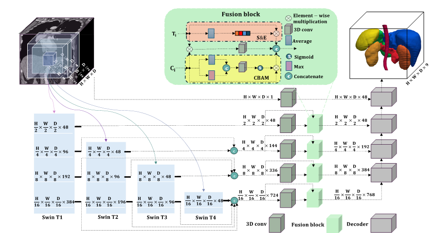
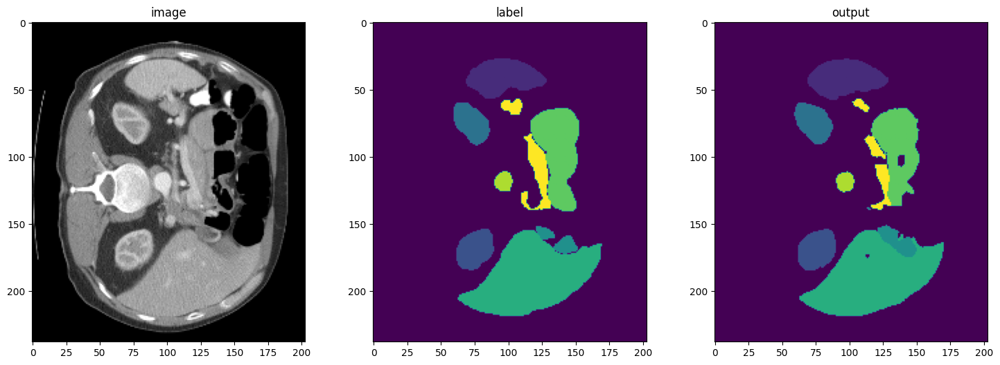
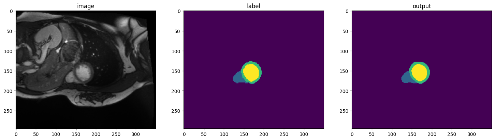

This is the official PyTorch implementation of the paper - "Multi-Aperture Fusion of Transformer-Convolutional Networks with Curvature-Aware Loss Function Enhances 3D Segmentation of Clinical and Microscopy Images".

## MAFTC-Net



## Set Up Set Up Environment
```
python3.10 -m venv MFTCNet_env 
source MFTCNet_env/bin/activate 
pip install -r requirements.txt
```

## Dataset

Download data from: https://www.synapse.org/#!Synapse:syn3193805/wiki/89480

### Structure of data folders 

data/  
&nbsp;|---imagesTr/  
&nbsp;&nbsp;&nbsp;&nbsp;&nbsp;|---img0001.nii.gz  
&nbsp;&nbsp;&nbsp;&nbsp;&nbsp;|---img0002.nii.gz  
&nbsp;|---labelsTr/  
&nbsp;&nbsp;&nbsp;&nbsp;&nbsp;|---label0001.nii.gz  
&nbsp;&nbsp;&nbsp;&nbsp;&nbsp;|---label0002.nii.gz  
&nbsp;|---dataset.json  


## Running the Code

This repository is built upon the foundational work provided in [Synapse](https://github.com/LeonidAlekseev/Swin-UNETR). 


## Training

Before training the configs.json file should be filled:

### Hyperparameters Configuration
The following settings can be adjusted in the `config.yaml` to configure the model training and data management:

- **`data_dir`**: Set the directory path for dataset storage.
- **`saved_model_dir`**: Set the directory path where trained models and checkpoints will be saved.
- **`num_samples`**: Define the number of samples used in training process.
- **`num_classes`**: Specify the number of target classes in the dataset + background.
- **`input_size`**: Set the size of the input images or data.
- **`input_channels`**: Define the number of input channels for the data (e.g., grayscale=1, RGB=3).
- **`feature_size`**: Set the dimension of the feature vectors extracted by the model.
- **`use_checkpoint`**: Enable or disable the use of model checkpoints for training continuation.
- **`learning_rate`**: Set the initial learning rate for the optimizer.
- **`weight_decay`**: Define the weight decay (L2 penalty) rate for regularization.
- **`max_iterations`**: Specify the maximum number of iterations (or training steps).
- **`eval_num`**: Set the frequency of evaluations (every `eval_num` iterations) during training.


# train the model 

## Synapse 
### From scrach:
```
python3 trainSynapse.py --checkpoint_dir ./checkpoints/synapse
```

### Resume the training:
```
python3 trainSynapse.py ./checkpoints/synapse/MAFTCNet_synapse.pth --checkpoint_dir ./checkpoints/synapse
```
## Testing 
```
python3 testSynapse.py ./checkpoints/synapse/MAFTCNet_synapse.pth
```

### Visualization for the output of model for ACDC:



## ACDC
### From scrach:
```
python3 trainACDC.py --checkpoint_dir ./checkpoints/acdc
```

### Resume the training:
```
python3 trainACDC.py ./checkpoints/acdc/MAFTCNet_ACDC.pth --checkpoint_dir ./checkpoints/acdc
```

## Testing 
```
python3 testACDC.py ./checkpoints/acdc/MAFTCNet_ACDC.pth
```

### Visualization for the output of model for ACDC:



## Pretrained Checkpoints

Please find the checkpoint of **MAFTC-Net** for the **Synapse, ACDC and organoid datasets** :

| Dataset   | Model      | Checkpoint | Notes |
|-----------|-----------|-------------|-------|
| ACDC      | MAFTC-Net | [Download](<https://drive.google.com/file/d/1NLhVQye7K6mlSeBNW_u9rjhNUvEuqNte/view?usp=sharing>)     | Cardiac MRI segmentation |
| Synapse   | MAFTC-Net | [Download](<https://drive.google.com/file/d/1CwnyUwG1lBtH-hIb5RCSVCs09WV1JEUl/view?usp=sharing>)  | Abdominal CT segmentation |
| Organoid  | MAFTC-Net | [Download](<https://drive.google.com/file/d/1g0xx3XjIDRHJ57336Q6Mi46ctpr-fLZ9/view?usp=sharing>) | 3D microscopy segmentation |


## Citation
If any part of this code is used, please give appropriate citations to our paper. <br />

## Contact
If you have any questions, please email sshabani@unr.edu to discuss with the authors. <br />

